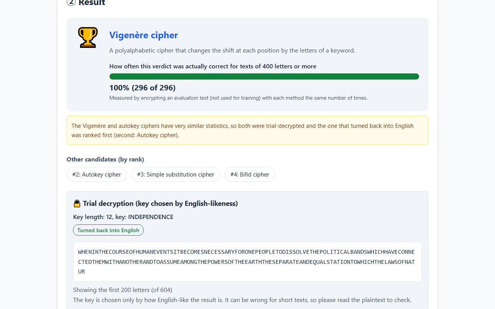
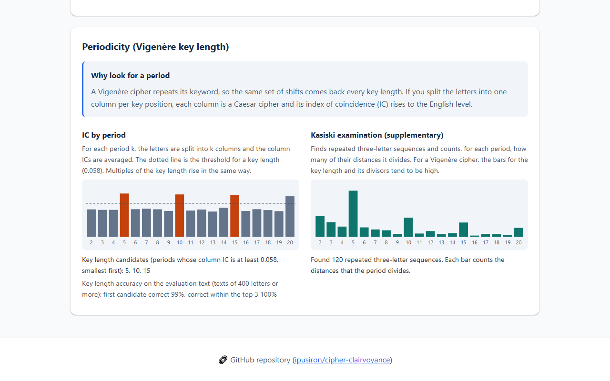
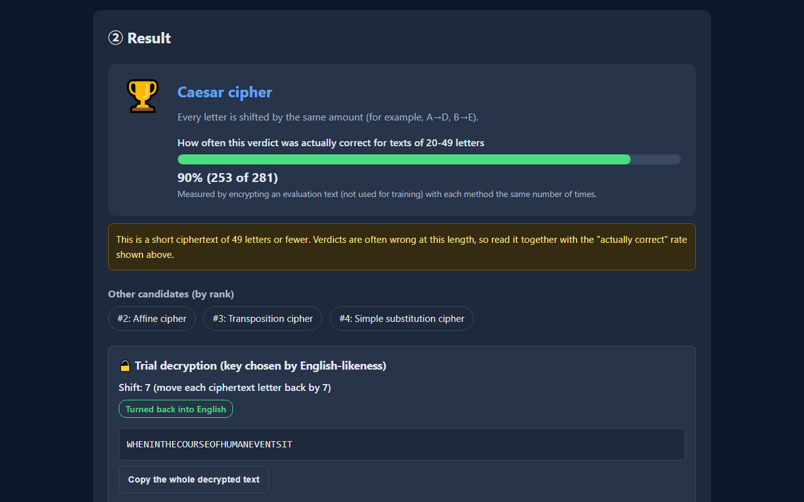
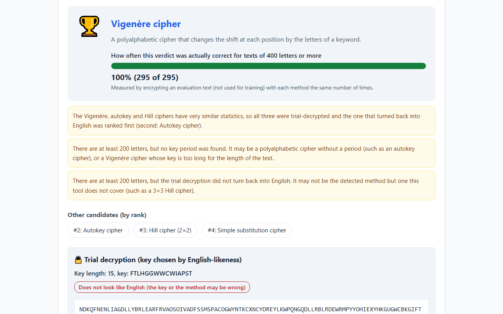

# Cipher Clairvoyance - Classical Cipher Identification Tool

English · [日本語](README.md)


[](https://ipusiron.github.io/cipher-clairvoyance/)

**Day044 - 100 Security Tools with Generative AI**

Cipher Clairvoyance is an educational web tool that estimates which classical cipher was used to encrypt English text. It shows every statistic behind the verdict in a table, together with the measured rate at which "this verdict for a ciphertext of this length" was actually correct. For the Caesar, affine, Vigenère, autokey and 2×2 Hill ciphers it goes on to guess the key and turn the text back into plaintext (a "trial decryption"), and it can pass the ciphertext to related tools so you can keep working on it.

"Clairvoyance" means the ability to see what cannot be seen.

---

## 🌐 Demo

👉 **[https://ipusiron.github.io/cipher-clairvoyance/](https://ipusiron.github.io/cipher-clairvoyance/?lang=en)**

Try it directly in your browser. The screen can be switched between Japanese and English (`?lang=en` opens it in English).

---

## 📸 Screenshots

>
>
>*A Vigenère verdict with the second stage and the trial decryption*

>
>
>*With a 5-letter Vigenère key, periods 5, 10 and 15 become key length candidates*

>
>
>*For a 30-letter ciphertext the measured rate drops and a note appears (dark mode)*

>
>
>*An unsupported 3×3 Hill cipher is labeled Vigenère, but the notes and the trial decryption show the problem*

---

## ✨ Features

- Verdict: ten kinds of text are told apart by statistics (plain English, Caesar, affine, simple substitution, Vigenère, autokey, Playfair, Bifid, 2×2 Hill and transposition); ADFGX/ADFGVX is recognized by its letters and the Polybius square by its digit pairs
- Actually correct: every verdict shows the rate measured for that length range on English text that was not used for training (the model's own probabilities are not shown)
- Trial decryption: guesses the key of the Caesar, affine (including Atbash), Vigenère, Beaufort-type, autokey and 2×2 Hill ciphers, shows the plaintext candidate and whether it reads as English, and copies the whole text with a button
- Second stage: the Vigenère, autokey and Hill ciphers have very similar statistics, so with 50 or more letters all three are trial-decrypted and the one that turns back into English is ranked first
- Why this verdict: a table of the 10 statistics (features) next to the typical values for plain English and the first and second places, plus the features that favored the first place, with explanations
- Notes: close calls, short texts, short polyalphabetic texts that cannot be told apart, trial decryptions that do not turn back into English (possibly an unsupported method), and missing periods
- Detailed analysis: letter frequencies (with a table of values), the index of coincidence by period with key length candidates, and Kasiski counts
- 18 samples: the opening of the US Declaration of Independence encrypted with the reference implementations, including two "failing cases" (an unsupported 3×3 Hill cipher and a short Vigenère cipher). Keys are shown with "Show key"
- Passing to related tools: the tool suggests decoding and learning tools from the series for the verdict, and opens the ones that accept input (Day009, 017, 030, 043, 046, 047, 049) with the ciphertext filled in
- Japanese/English switch, light/dark switch, keyboard operation and a status message for screen readers

---

## 🔐 Supported methods

| Method | Main clue |
|---|---|
| Plain English (not encrypted) | Both the letter frequencies and the adjacent letter pairs are English |
| Caesar cipher | One of the 26 shifts brings the frequencies back to English |
| Affine cipher | One of the 312 affine maps brings the frequencies back to English (a shift alone does not) |
| Simple substitution cipher | The index of coincidence is at the English level, but no shift or affine map brings the frequencies back |
| Vigenère cipher | The index of coincidence drops, and splitting into columns by the key length brings it back to the English level. The Beaufort type (the alphabet runs backwards in each column) has the same statistics and is recognized by the trial decryption |
| Autokey cipher | The index of coincidence drops but there is no period. It is told apart from the Vigenère and Hill ciphers by the trial decryption |
| Playfair cipher | Even length, no J, and no pair of the same letter in the pairs |
| Bifid cipher | No J and a lower index of coincidence, but unlike Playfair the length may be odd and doubled pairs occur |
| Hill cipher (2×2) | The index of coincidence drops and there is no period, but a trial decryption with a 2×2 key matrix turns it back into English. It is told apart from the Vigenère and autokey ciphers by the trial decryption |
| Transposition cipher | The letter frequencies stay English but the adjacent pairs do not look English (rail fence, columnar, turning grille and so on are not told apart) |
| ADFGX/ADFGVX cipher | The ciphertext uses only A, D, F, G, (V) and X (no statistics needed) |
| Polybius square cipher | The input consists only of pairs of the digits 1-5. It is turned back into letters with the standard table and then analyzed: "plain English" for the standard table, "simple substitution" for a shuffled one |

---

## 📊 Accuracy by length (measured)

Text that was not used for training (an excerpt of Dickens, A Tale of Two Cities) was encrypted 300 times with each method for each length range, and the table shows the share whose correct method came first. To reflect how real ciphertexts vary, the training and evaluation ciphertexts mix variants: Vigenère keys have 2-20 letters, autokey primers 1-12 letters, the Hill cipher uses any invertible 2×2 matrix, Playfair pads with X, Q or Z, the Bifid cipher uses the whole text and 3-15 letter blocks half the time each, and the transposition cipher mixes columnar transposition (3-15 columns, unpadded or padded with X or random letters), rail fence (2-10 rails) and permutation within blocks in equal parts. The verdicts follow the same procedure as the screen, including the second stage for the Vigenère, autokey and Hill ciphers.

| Method | 20-49 letters | 50-99 letters | 100-199 letters | 200-399 letters | 400+ letters |
|---|---|---|---|---|---|
| Plain English (not encrypted) | 96% | 97% | 98% | 100% | 100% |
| Caesar cipher | 84% | 95% | 97% | 99% | 100% |
| Affine cipher | 70% | 94% | 99% | 99% | 100% |
| Simple substitution cipher | 50% | 93% | 100% | 100% | 100% |
| Vigenère cipher | 13% | 79% | 95% | 97% | 98% |
| Autokey cipher | 24% | 63% | 95% | 99% | 100% |
| Playfair cipher | 98% | 98% | 98% | 99% | 99% |
| Bifid cipher | 54% | 74% | 92% | 99% | 100% |
| Hill cipher (2×2) | 52% | 85% | 95% | 99% | 99% |
| Transposition cipher | 76% | 93% | 99% | 98% | 100% |

The key length estimate for the Vigenère cipher (the same 300 Vigenère ciphertexts per range) is as follows.

| Key length | 20-49 letters | 50-99 letters | 100-199 letters | 200-399 letters | 400+ letters |
|---|---|---|---|---|---|
| First candidate correct | 19% | 43% | 78% | 95% | 99% |
| Correct within the top 3 | 31% | 69% | 96% | 100% | 100% |

The "actually correct" rate on the screen is, in the evaluation above, the share of verdicts naming a method for a length range that really were that method. It assumes every method is equally common and does not cover unsupported methods (such as the Hill cipher).

With 20-49 letters, the Vigenère, autokey, Bifid and Hill ciphers can hardly be told apart even by statistics. When one of these four is the verdict at this length, the screen suggests trying the lower-ranked methods too.

---

## 📖 How to use

1. Paste the ciphertext into the input box (characters other than A-Z and spaces are ignored; at least 20 letters are needed; input made only of pairs of the digits 1-5 is read as a Polybius square cipher)
2. Press "🔍 Analyze" (Ctrl+Enter, or ⌘+Enter on a Mac, also works)
3. Check the first-place method and how often that verdict was actually correct at this length. Read any notes
4. If a trial decryption appears, check whether the result reads as English
5. Use the table under "Why this verdict" to compare which statistics are close to the typical values of which method
6. If needed, open "📊 Show the detailed analysis" for the letter frequencies, the index of coincidence by period and the Kasiski counts
7. Continue with the decoding and learning tools under "🔧 Tools to try next". "Open it with this ciphertext" opens the tool with the text filled in

"📄 Load a sample" offers 18 practice ciphertexts.

---

## 🔬 How it works

The tool computes 10 statistics from the ciphertext (the index of coincidence, the distance from English letter frequencies, the distance after the best shift and the best affine map, the gain in the index of coincidence when the text is split by a period, the English-likeness of adjacent letter pairs and so on) and, for each length range, compares them with the typical distributions of each method (naive Bayes classification). The distributions come from encrypting an excerpt of Jane Austen's Pride and Prejudice with each method, and the evaluation uses a different book.

The Vigenère, autokey and Hill ciphers have very similar statistics when no period is visible. With 50 or more letters, if the first place is one of them, all three are trial-decrypted and the one whose result is more English-like (by how common its adjacent letter pairs are) is ranked first.

Training and evaluation run in a script with a fixed random seed (`tools/build-model.mjs`), so rebuilding always gives the same model (`js/model.js`). The tests check this too. The formulas, thresholds and evaluation procedure are described in [ALGORITHM.md](ALGORITHM.md) (in Japanese).

---

## 🎯 Use cases

Ways of using this tool in particular

- Watching the verdict go wrong outside the training data (AI and statistics classes): enter Japanese plaintext written in romaji, `WATASHI WA KINOU TOMODACHI TO ISSHO NI EKI NO CHIKAKU NO KISSATEN DE KOOHII WO NONDE KARA HON YA NI ITTE ATARASHII SHOSETSU WO KATTA` (108 letters), and although it is not a cipher the tool says "Simple substitution cipher" and shows that this verdict was actually correct 87% of the time (300 of 343) at this length. The Iroha poem in the same spelling as the example in [Frequency Analyzer](https://ipusiron.github.io/frequency-analyzer/) (Day009), 91 letters, becomes "Transposition cipher". The model learned from English only (Pride and Prejudice), so text that uses letters differently from English looks like English with its letters replaced or reordered. The rate shown was measured on English ciphertexts, and you can see that it means little once the input leaves that assumption
- Checking a verdict that does not rest on one statistic (comparing with another tool): take the opening of Gadsby, a novel written without the letter E, `IF YOUTH THROUGHOUT ALL HISTORY HAD HAD A CHAMPION TO STAND UP FOR IT TO SHOW A DOUBTING WORLD THAT A CHILD CAN THINK` (94 letters), encrypt it with a Caesar shift of 7 and enter it; the tool says "Caesar cipher" and the trial decryption returns English with shift 7. [Caesar Cipher Breaker](https://ipusiron.github.io/caesar-cipher-breaker/) (Day008) shows a sentence without E where the top letter-frequency guess fails. This tool combines 10 statistics, such as the index of coincidence and how English the letter pairs look, so it finds the method even when the frequency of E is off (with a short 32-letter sentence without E, this tool fails too)
- Feeling how hard it is to tell random letters from a polyalphabetic cipher (information classes): enter letters in random order and the tool calls them a polyalphabetic cipher such as Vigenère. Polyalphabetic ciphers without a period and random letters are hard to tell apart by letter statistics. With at least 200 letters, two notes appear, that no key period was found and that the trial decryption did not turn back into English, which gives a reason to doubt the top verdict (below 200 letters these two notes do not appear)

General uses

- Information and math classes: have students encrypt the same plaintext with several methods, put the tables under "Why this verdict" side by side, and find which statistics each method breaks and which it keeps
- Introduction to statistics and machine learning: read "what" a naive Bayes classifier looks at, as typical values per feature and the difference between first and second place. The tables also show in numbers why training and evaluation texts are kept apart and how accuracy drops for short texts
- First steps on a CTF crypto challenge: get a hint about the method of a classical-looking ciphertext; if the trial decryption is readable, you are done, otherwise pass the ciphertext to a related tool. Remember that methods outside the list are still assigned to one of the listed ones
- Practice in doubting a machine's verdict: load the failing cases (an unsupported 3×3 Hill cipher and a short Vigenère cipher) to see why a verdict can be wrong despite a high rate, and how the notes and the trial decryption reveal the mistake
- Making puzzle events and escape games: before publishing, check what your ciphertext looks like statistically, whether it is too short to guess, and whether it looks like the intended method
- Solving puzzles: before starting, get a hint whether letters were replaced or rearranged and whether there is a period
- History lessons: touch on the history of cryptography through the ADFGVX cipher used by the German army in World War I and samples made from the Declaration of Independence
- Props for novels, games and films: check that a ciphertext shown in the story has believable statistics
- Learning programming: the reference implementations, features, model generation and tests are small, so you can read how reproducibility with a fixed random seed and tests that pin generated files work
- A baseline for research and teaching materials: compare another identification method with the same procedure as the accuracy tables
- Combining with other tools in the series: pass the ciphertext to Frequency Analyzer (Day009) for a closer look at frequencies, pass it with the key length candidate to Modular Text Divider (Day030) to solve it column by column, solve a transposition in the Columnar CipherLab (Day043) solver lab, find the key from column-wise candidates in AlphaLoom (Day046), and pass the ciphertext to IC Learning Visualizer (Day047) to see the key length candidates with their multiples and learn what the index of coincidence means

---

## ⚠️ Notes and limitations

- The tool assumes encrypted English. Text in other languages has different statistics, so the verdict will be wrong
- Methods outside the list (such as a 3×3 Hill cipher) are still assigned to one of the methods, usually Vigenère, autokey or Hill, and the "actually correct" rate does not apply to them. With 200 or more letters, a note shows that the trial decryption did not turn back into English
- The shorter the text, the more often the verdict is wrong. With 20-49 letters, the Vigenère, autokey, Bifid and Hill ciphers can hardly be told apart (see the table above)
- The training and evaluation mix the variants above, but other constructions (double transposition, Vigenère keys of 21 or more letters and so on) may lower the accuracy
- The "actually correct" rate is measured assuming every method is equally common. It does not reflect how often you actually meet each method
- The trial decryption chooses the key only by how English-like the result is, so it fails on short texts. Breaking simple substitution, Playfair, Bifid, transposition and ADFGVX is the job of the related tools
- For the Beaufort type only the plaintext is shown, because sources write its key in different ways
- Only the 5×5 Polybius square with the digits 1-5 is read (a 6×6 table or coordinates written in other symbols are not supported)

---

## 🧪 Tests

```bash
npm test
```

- Runs on the standard test runner of Node.js 22 or later (`node:test`), with no dependencies
- GitHub Actions runs the tests on every push and pull request
- Main contents: known answers from the examples in the English Wikipedia articles on each cipher, encryption-decryption round trips, the trial decryption recovering keys and plaintexts, the second stage, regeneration of the model and the samples, minimum accuracy per length range, input checks, the URLs for passing ciphertexts, the Japanese and English dictionaries, color contrast, and static checks of the HTML (CSP and so on)
- The accuracy tables, the number of samples and the directory structure in this README and in the Japanese README are also checked against the model and the actual files

---

## 🔒 Security

- The ciphertext you enter is processed only inside the browser and is not sent anywhere. When you press "Open it with this ciphertext", the letters of the ciphertext go after the "#" in the URL of the related tool. The part after "#" is not sent to the server. The URL as opened may remain in the browser history
- The Content Security Policy limits scripts and styles to files from the same origin and allows no inline scripts or styles
- Entered text is displayed only through `textContent` (never interpreted as HTML)
- The browser stores only the light/dark and language choices, and the tool works where storage is unavailable

---

## 🔗 Related tools

Depending on the verdict, the screen lists the following tools under "🔧 Tools to try next" (all from "100 Security Tools with Generative AI"). Tools that accept input also get a link that opens them with the ciphertext filled in.

| Tool | How it is passed |
|---|---|
| Frequency Analyzer (Day009) | `#text=` (up to 5,000 letters) |
| Vigenère Cipher Tool (Day017) | `#text=` |
| Modular Text Divider (Day030) | `#text=…&n=…` (n is the first key length candidate, 1-20) |
| AlphaLoom (Day046) | `#text=` (up to 10,000 letters; AlphaLoom estimates the key length) |
| IC Learning Visualizer (Day047) | `#text=…&tab=advanced` (up to 10,000 letters; opens key length estimation) |
| Columnar CipherLab (Day043) | `#tab=lab&c=…&m=incomplete` (the solver lab) |
| Affine CipherLab (Day049) | `#text=` (opens the brute-force attack) |

Every link passes the ciphertext after "#", so it is not sent to the server and is not subject to the URL length limit. GitHub Pages returns "414 URI Too Long" when the path and the part after "?" exceed 8,192 bytes, so passing after "?" would end on an error page beyond about 8,150 letters.

The first period by index of coincidence can be a divisor of the key length, so AlphaLoom gets no key length and estimates it itself (for the sample with the 12-letter key INDEPENDENCE, the first candidate is 6). Key length estimation in IC Learning Visualizer (Day047) lists the candidates with their multiples.

- [Caesar Cipher Breaker (Day008)](https://ipusiron.github.io/caesar-cipher-breaker/): solve a Caesar cipher by brute force
- [Frequency Analyzer (Day009)](https://ipusiron.github.io/frequency-analyzer/): look at letter frequencies in detail
- [Vigenère Cipher Tool (Day017)](https://ipusiron.github.io/vigenere-cipher-tool/): encrypt and decrypt the Vigenère cipher
- [Cipher Climb (Day018)](https://ipusiron.github.io/cipherclimb/): solve simple substitution by hill climbing
- [Grille CipherLab (Day024)](https://ipusiron.github.io/grille-cipherlab/): the turning grille
- [Playfair CipherLab (Day027)](https://ipusiron.github.io/playfair-cipherlab/): the Playfair cipher
- [RepeatSeq Analyzer (Day028)](https://ipusiron.github.io/repeatseq-analyzer/): find the key length from repeats
- [Modular Text Divider (Day030)](https://ipusiron.github.io/modular-text-divider/): split the text into columns by period
- [RailFence CipherLab (Day034)](https://ipusiron.github.io/railfence-cipherlab/): the rail fence cipher
- [Columnar CipherLab (Day043)](https://ipusiron.github.io/columnar-cipherlab/): columnar transposition
- [AlphaLoom (Day046)](https://ipusiron.github.io/alphaloom/): find a Vigenère key from column-wise candidates
- [IC Learning Visualizer (Day047)](https://ipusiron.github.io/ic-learning-visualizer/): learn the index of coincidence
- [Affine CipherLab (Day049)](https://ipusiron.github.io/affine-cipherlab/): the affine cipher

---

## 📁 Directory structure

```
cipher-clairvoyance/
├── .github/                  # GitHub settings
│   └── workflows/            # GitHub Actions workflows
│       └── test.yml          # Runs npm test on push and pull request
├── assets/                   # Images
│   ├── en/                   # Screenshots of the English screen
│   │   ├── screenshot.png    # Screenshot (verdict and trial decryption)
│   │   ├── screenshot2.png   # Screenshot (periodicity)
│   │   ├── screenshot3.png   # Screenshot (short ciphertext, dark mode)
│   │   └── screenshot4.png   # Screenshot (failing case: 3×3 Hill cipher)
│   ├── favicon.ico           # Favicon (ICO)
│   ├── favicon.svg           # Favicon (SVG)
│   ├── screenshot.png        # Screenshot (verdict and trial decryption)
│   ├── screenshot2.png       # Screenshot (periodicity)
│   ├── screenshot3.png       # Screenshot (short ciphertext, dark mode)
│   └── screenshot4.png       # Screenshot (failing case: 3×3 Hill cipher)
├── js/                       # JavaScript (ES modules; only file-check.js and theme-init.js are classic scripts)
│   ├── analysis.js           # From input checks to the verdict and evidence (no DOM)
│   ├── app.js                # Events, modals and the analysis flow
│   ├── cipher-core.js        # Reference implementations of the ciphers (training data, samples, trial decryption, tests)
│   ├── classifier.js         # Naive Bayes classification per length range and the features that favored first place
│   ├── decide.js             # The verdict flow (second stage for Vigenère/autokey)
│   ├── features.js           # Features (index of coincidence, χ², IC by period and so on)
│   ├── file-check.js         # Notice when the tool could not start from file://
│   ├── help-content.js       # Help text (Japanese and English)
│   ├── i18n.js               # Choosing the language and replacing the static text on the screen
│   ├── keylength.js          # Vigenère key length estimate and Kasiski counts
│   ├── links.js              # Related tools and links that pass the ciphertext
│   ├── messages.js           # Dictionary of the text on the screen (Japanese and English)
│   ├── model.js              # Classification model (generated by tools/build-model.mjs)
│   ├── samples.js            # Sample ciphertexts (generated by tools/build-samples.mjs)
│   ├── solver.js             # Trial decryption (Caesar, affine, Vigenère type, autokey)
│   ├── theme-init.js         # Applies the theme at the very start of loading
│   ├── theme.js              # Light/dark switch
│   ├── ui.js                 # Drawing the result, evidence, details and help tables
│   └── visualization.js      # Drawing the charts (SVG)
├── test/                     # Tests (node:test)
│   ├── analysis.test.js      # Input checks, verdicts and notes
│   ├── contrast.test.js      # Color contrast (light and dark)
│   ├── core.test.js          # Known answers and round trips of the ciphers
│   ├── features.test.js      # Features and the key length estimate
│   ├── format.test.js        # Line length, line counts and control characters
│   ├── html.test.js          # Static checks of index.html (CSP, attributes, elements)
│   ├── i18n.test.js          # Japanese and English dictionaries, help and language choice
│   ├── links.test.js         # Related tool links and passing URLs
│   ├── messages.test.js      # Text dictionary
│   ├── model.test.js         # Model regeneration, shape and minimum accuracy
│   ├── readme.test.js        # README (Japanese and English) tables, metadata, directory structure and headings
│   ├── samples.test.js       # Sample regeneration, round trips and verdicts
│   └── solver.test.js        # Trial decryption and the second stage
├── tools/                    # Development scripts (not used by the screen)
│   ├── corpus/               # English excerpts for training and evaluation (letters only)
│   │   ├── eval-pg98.txt     # Evaluation: A Tale of Two Cities (Project Gutenberg #98)
│   │   └── train-pg1342.txt  # Training: Pride and Prejudice (Project Gutenberg #1342)
│   ├── build-model.mjs       # Trains, evaluates and writes the model (--check verifies it)
│   ├── build-samples.mjs     # Writes the sample ciphertexts (--check verifies them)
│   └── make-corpus.mjs       # Makes an English excerpt from a Gutenberg text
├── .gitignore                # Files excluded from Git
├── .nojekyll                 # Tells GitHub Pages not to use Jekyll
├── ALGORITHM.md              # Formulas, thresholds and evaluation procedure (Japanese)
├── CLAUDE.md                 # Development notes for Claude Code
├── LICENSE                   # License (MIT)
├── README.en.md              # This file
├── README.md                 # README in Japanese
├── index.html                # The screen
├── package.json              # npm test settings (no dependencies)
└── style.css                 # Styles (light and dark colors)
```

---

## 💻 Requirements

- A recent browser such as Chrome, Edge or Firefox (with ES module support)
- Works at smartphone widths (320 px and up)
- To run it locally, run `python -m http.server 8000` or similar in the folder and open `http://localhost:8000/`. In Chrome and Edge, opening index.html directly as a file cannot load ES modules and the tool does not run (a notice appears on the screen)

---

## 📄 License

- See the `LICENSE` file for the license of the source code.
- The English excerpts used for training and evaluation (`tools/corpus/`) contain only the letters of the body text of the Project Gutenberg eBooks #1342 Pride and Prejudice and #98 A Tale of Two Cities. Both are in the public domain in the United States.
- The sample plaintext is the opening of the US Declaration of Independence (1776, public domain).

---

## 🛠️ About this tool

This tool was developed as part of the "100 Security Tools with Generative AI" project.
The project creates and publishes a variety of security-related tools over 100 days with the help of AI.

For details of the project and the other tools, see the following page (in Japanese).

🔗 [https://akademeia.info/?page_id=42163](https://akademeia.info/?page_id=42163)
