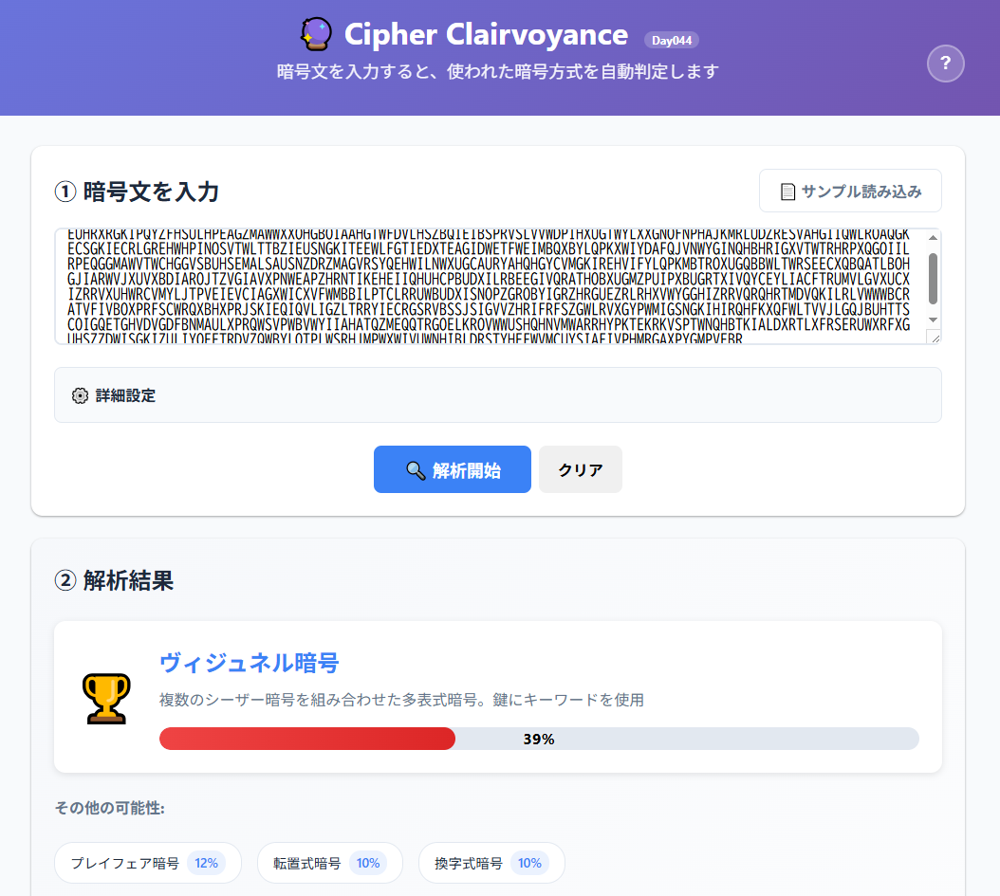

# Cipher Clairvoyance - 古典暗号方式推測ツール

**Day043 - 生成AIで作るセキュリティツール100**

**Classical Cipher Identification & Visualization**  
暗号文から用いられた古典暗号を推定・特定する軽量Webツールです。

シンプルで直感的なUIにより、初心者から専門家まで幅広く古典暗号の学習・解析を支援します。

なお、"clairvoyance"は「クレアボヤンス」と読み、「千里眼」「透視能力」を意味します。

---

## 🌐 デモページ

👉 **[https://ipusiron.github.io/cipher-clairvoyance/](https://ipusiron.github.io/cipher-clairvoyance/)**

ブラウザーで直接お試しいただけます。

---

## 📸 スクリーンショット

>   
>
> *ダミー*

---

## 🔐 サポートしている暗号方式

### 📋 検出・解析可能な暗号

| 暗号方式 | 説明 | サンプル例 |
|----------|------|------------|
| **シーザー暗号** | 各文字を固定数シフトするもっとも基本的な暗号 | `KHOOR ZRUOG` |
| **アフィン暗号** | 文字を数式(ax+b)で変換するシーザー暗号の拡張 | `IHHWVC SWFRCP` |
| **ヴィジュネル暗号** | キーワードを使った多表式暗号 | `AJIM QZ DPC...` |
| **プレイフェア暗号** | 2文字ずつ5×5の表で置換する暗号 | `BMODZBXDNA...` |
| **レールフェンス暗号** | 文字をジグザグ状に配置する転置式暗号 | `WEIECUSOHMN...` |
| **縦列転置暗号** | 文字を列状に配置してキーワード順に読み取る | `HEOEUEEVNTB...` |
| **回転グリル暗号** | 正方形の格子を回転させながら配置 | `WNHETIEORPN...` |
| **ADFGX(VX)暗号** | 文字をADFGX(V)のみで表現するドイツ軍暗号 | `ADFGADXGAFD...` |

### 🎯 高精度検出機能

- **統計的分析**: IoC（一致指数）、χ²統計量、n-gram分析
- **周期性検出**: 自己相関、Kasiski法による鍵長推定
- **パターン認識**: 文字集合、偶数長判定、特殊パターン検出
- **確率的判定**: Softmax正規化による信頼度表示

---

## ✨ 主な機能

### 🎯 シンプルで直感的なUI
- **3段階表示**: 基本結果 → 詳細分析 → 専門家向け分析
- **信頼度バー**: 判定結果の確信度を視覚的に表示
- **段階的詳細**: 必要に応じて詳細情報を展開
- **豊富なサンプル**: アメリカ独立宣言を使った7種類の実践的サンプル

### 📊 高度な分析機能
- **統計分析**: IoC（一致指数）、χ²統計量、英語らしさ判定
- **周期性分析**: 自己相関、Kasiski法によるVigenère暗号の鍵長推定
- **可視化**: 文字頻度グラフ、自己相関チャート、GCDヒストグラム
- **パターン検出**: 各暗号方式特有のパターンを自動識別

### 🔬 専門家向け機能
- **詳細統計**: 列IC分析、繰り返しパターン検出
- **アルゴリズム選択**: 解析手法を個別に有効/無効化
- **教育サポート**: 各統計量の意味を説明するヘルプ機能

---

## ⚙ 実装メモ
- 英語テキスト前提のヒューリスティクス。
  - 短文や多言語は誤判定の可能性あり
- 確率は「Softmax正規化された evidence」＝擬似確率（教育向けの目安）
- 4-gramログ尤度や自動復号の各方式は将来追加予定

---

## 🚀 使い方

1. **暗号文を入力**: テキストエリアに解析したい暗号文を入力
2. **サンプル利用**: 「📄 サンプル読み込み」から練習用の暗号文を選択
3. **解析実行**: 「🔍 解析開始」ボタンで自動解析
4. **結果確認**: もっとも可能性の高い暗号方式と信頼度を確認
5. **詳細分析**: 必要に応じて統計情報や専門家向け分析を展開

## 🗺 Roadmap

- 4-gram：尤度スコア＋可視化
- 縦列転置暗号やレールフェンス暗号の列幅/レール数推定→復元→スコア
- Bifid/Trifid/Hillの簡易テスター
- ヴィジュネル暗号の派生系（Beaufort / Porta / Autokey）の識別強化
- 多言語対応：n-gram（ja/de/fr/…）切替

---

## 📄 ライセンス

MIT License - 詳細は [LICENSE](LICENSE) をご覧ください。

---

## 🛠 このツールについて

本ツールは、「生成AIで作るセキュリティツール100」プロジェクトの一環として開発されました。  
このプロジェクトでは、AIの支援を活用しながら、セキュリティに関連するさまざまなツールを100日間にわたり制作・公開していく取り組みを行っています。

プロジェクトの詳細や他のツールについては、以下のページをご覧ください。

🔗 [https://akademeia.info/?page_id=42163](https://akademeia.info/?page_id=42163)