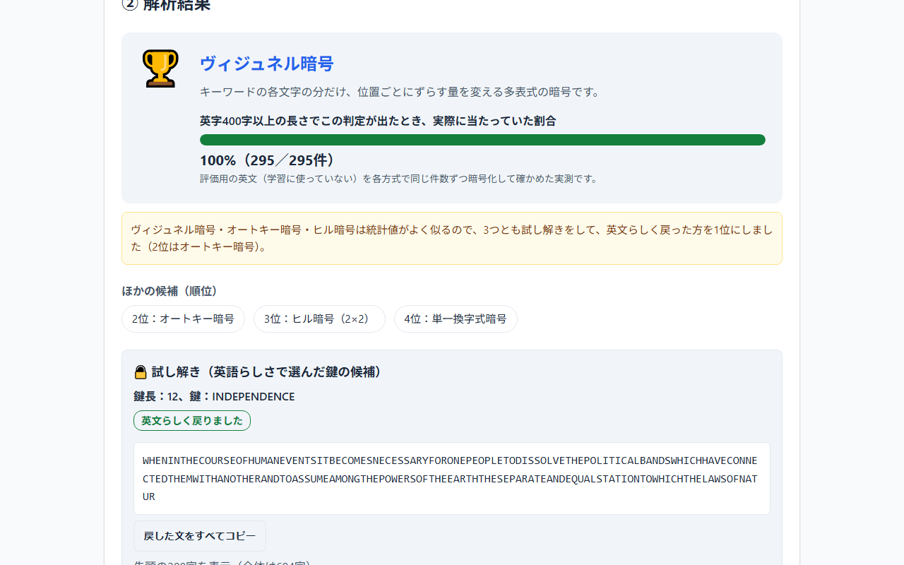
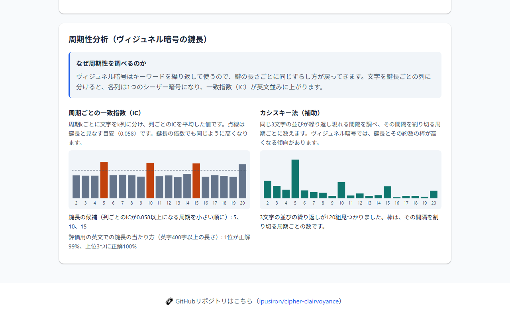
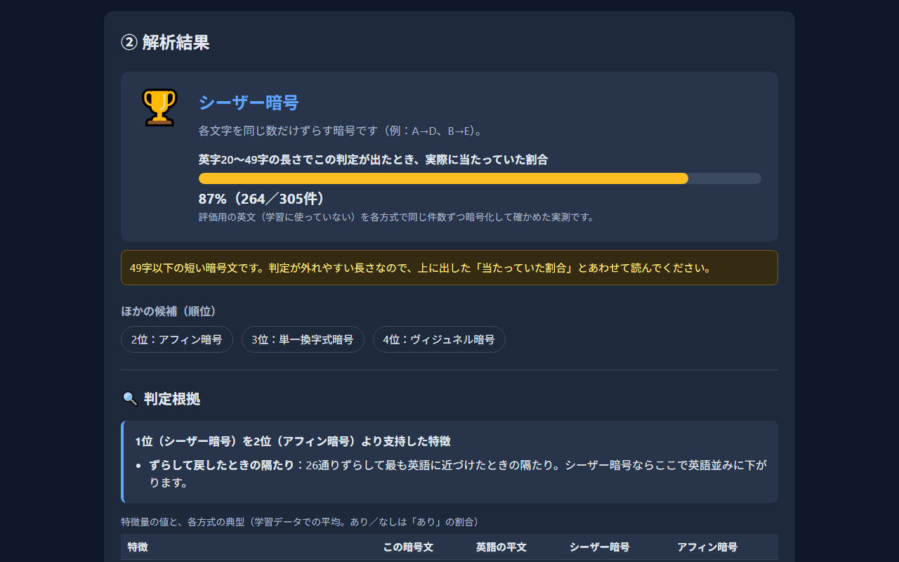
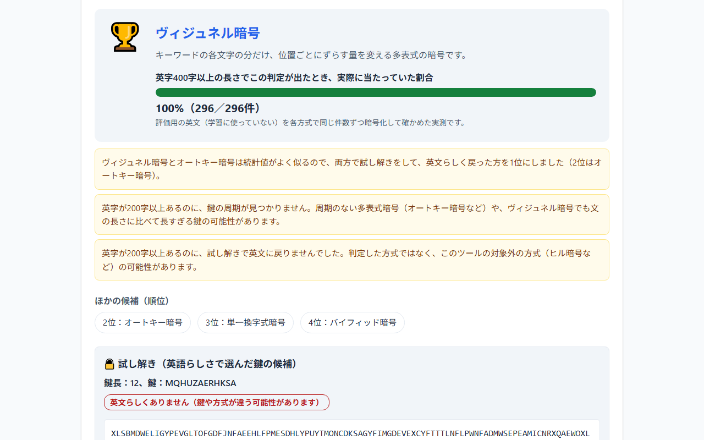

<!--
---
id: day044
slug: cipher-clairvoyance

title: "Cipher Clairvoyance"

subtitle_ja: "暗号化方式推定ツール"
subtitle_en: "Classical Cipher Identification Tool"

description_ja: "英文を古典暗号で暗号化した文から、使われた方式を推定する教育用Webツール。シーザー・アフィン・単一換字・ヴィジュネル・オートキー・プレイフェア・バイフィッド・ヒル（2×2）・転置・ADFGVX・ポリュビオスと平文を見分け、判定に使った統計値と長さ別に実測した正答率を示し、試し解きで平文の候補を出します。"
description_en: "An educational web tool that identifies which classical cipher was used on English text. It distinguishes Caesar, Affine, simple substitution, Vigenère, Autokey, Playfair, Bifid, 2x2 Hill, transposition, ADFGVX, Polybius and plaintext, shows the statistics behind each verdict with accuracy measured by text length, and suggests a trial decryption."

category_ja:
  - 古典暗号
  - 暗号解析
category_en:
  - Classical Cryptography
  - Cryptanalysis

difficulty: 3

tags:
  - classical-cipher
  - cryptanalysis
  - cipher-identification
  - statistics
  - naive-bayes
  - index-of-coincidence
  - CTF
  - educational

repo_url: "https://github.com/ipusiron/cipher-clairvoyance"
demo_url: "https://ipusiron.github.io/cipher-clairvoyance/"

hub: true
---
-->

# Cipher Clairvoyance - 暗号化方式推定ツール

[English](README.en.md) · 日本語


[](https://ipusiron.github.io/cipher-clairvoyance/)

**Day044 - 生成AIで作るセキュリティツール100**

Cipher Clairvoyanceは、英文を古典暗号で暗号化した文から、使われた方式を推定する教育用Webツールです。判定に使った統計値をすべて表で見せ、「この長さの暗号文でこの判定が出たとき、実際に当たっていた割合」を実測値で示します。シーザー・アフィン・ヴィジュネル・オートキー・ヒル（2×2）は、鍵を推し量って平文に戻す「試し解き」まで行い、関連ツールへ暗号文を渡して解読を続けられます。

なお、"clairvoyance"は「クレアボヤンス」と読み、「千里眼」「透視能力」を意味します。

---

## 🌐 デモページ

👉 **[https://ipusiron.github.io/cipher-clairvoyance/](https://ipusiron.github.io/cipher-clairvoyance/)**

ブラウザーで直接お試しいただけます。画面は日本語と英語を切り替えられます（`?lang=en`で英語の画面を開けます）。

---

## 📸 スクリーンショット

>
>
>*ヴィジュネル暗号の判定と、2段目の見分け・試し解きの結果*

>
>
>*5字の鍵のヴィジュネル暗号で、周期5・10・15が鍵長の候補になる*

>
>
>*30字の短い暗号文では、当たっていた割合が下がり、お知らせが出る（ダークモード）*

>
>
>*対象外の3×3のヒル暗号はヴィジュネル暗号と出るが、お知らせと試し解きで気づける*

---

## ✨ 主な機能

- 判定: 英語の平文・シーザー・アフィン・単一換字・ヴィジュネル・オートキー・プレイフェア・バイフィッド・ヒル（2×2）・転置の10通りを統計で見分け、ADFGX／ADFGVXは文字の種類で、ポリュビオス暗号は数字の組で見分ける
- 当たっていた割合: 学習に使っていない英文で長さ帯ごとに実測した値を、判定のたびに表示する（モデルの確率は出さない）
- 試し解き: シーザー・アフィン（アトバシュを含む）・ヴィジュネル・ボーフォート型・オートキー・ヒル（2×2）の鍵を推し量り、平文の候補と、それが英文らしいかを示す。戻した文はボタンで全文をコピーできる
- 2段目の見分け: 統計値がよく似るヴィジュネル暗号・オートキー暗号・ヒル暗号は、英字50字以上なら3つとも試し解きして、英文らしく戻った方を1位にする
- 判定根拠: 10個の統計値（特徴量）の値と、英語の平文・1位・2位の典型値を並べた表。1位を2位より支持した特徴を説明つきで示す
- お知らせ: 接戦、短い暗号文、短い多表式は見分けられないこと、試し解きで英文に戻らない（対象外の方式の可能性）、周期が見えない
- 詳細な分析: 文字の頻度（数値の表つき）、周期ごとの一致指数と鍵長の候補、カシスキー法の集計
- サンプル18件: アメリカ独立宣言の冒頭を参照実装で暗号化したもの。対象外の3×3のヒル暗号と短いヴィジュネル暗号の「判定が崩れる例」も含む。鍵は「鍵を見る」で表示を切り替える
- 関連ツールへの受け渡し: 判定結果に合わせてシリーズの解読・学習ツールを示し、受け取り口のあるツール（Day009・017・030・043・046・047・049）には暗号文を渡して開ける
- 日本語／英語の切り替え、ライト／ダークの切り替え、キーボード操作、読み上げ用の状態表示

---

## 🔐 判定できる方式

| 方式 | 見分け方の中心 |
|---|---|
| 英語の平文のまま | 文字の頻度も、隣り合う2文字の並びも英語のまま |
| シーザー暗号 | 26通りのずらしのどれかで英語の頻度に戻る |
| アフィン暗号 | 312通りのアフィン変換のどれかで英語の頻度に戻る（ずらしだけでは戻らない） |
| 単一換字式暗号 | 一致指数は英語並みなのに、ずらしやアフィン変換では英語の頻度に戻らない |
| ヴィジュネル暗号 | 一致指数が下がり、鍵長の周期で列に分けると英語並みに戻る。ボーフォート型（各列で字の並びが逆向き）も同じ統計になり、試し解きで見分ける |
| オートキー暗号 | 一致指数が下がるのに周期がない。ヴィジュネル暗号・ヒル暗号とは試し解きで見分ける |
| プレイフェア暗号 | 偶数の長さ、Jが出ない、2文字ずつの組に同じ字が並ばない |
| バイフィッド暗号 | Jが出ず一致指数が下がるが、プレイフェアと違って奇数の長さや同じ字の組もある |
| ヒル暗号（2×2） | 一致指数が下がり周期もないが、2×2の鍵の行列で試し解きすると英文に戻る。ヴィジュネル暗号・オートキー暗号とは試し解きで見分ける |
| 転置式暗号 | 文字の頻度は英語のままなのに、隣り合う2文字の並びが英語らしくない（レールフェンス・縦列転置・回転グリルなどを区別せずにまとめる） |
| ADFGX／ADFGVX暗号 | 暗号文がA・D・F・G・(V)・Xだけでできている（統計を使わない） |
| ポリュビオス暗号 | 入力が1〜5の数字の組だけでできている。標準の表で字に戻してから判定し、標準の表なら「英語の平文のまま」、表を並べ替えていれば「単一換字式暗号」と出る |

---

## 📊 長さ別の正答率（実測）

学習に使っていない英文（ディケンズ『二都物語』の抜粋）を、各方式で長さ帯ごとに300件ずつ暗号化して判定し、正しい方式が1位になった割合です。実物の暗号文の揺れを入れるため、学習と評価の暗号文には変種を混ぜています。ヴィジュネル暗号の鍵長は2〜20字、オートキー暗号のプライマーは1〜12字、ヒル暗号は逆行列のある2×2の行列、プレイフェア暗号の埋字はX・Q・Zのどれか、バイフィッド暗号は文全体と3〜15字のブロックを半分ずつ、転置式暗号は縦列転置（3〜15列。埋字なし・X・ランダムな英字）・レールフェンス（2〜10段）・ブロック内の並べ替えを同じ割合で混ぜています。ヴィジュネル・オートキー・ヒルの2段目の見分けも含め、画面と同じ手順で判定しています。

| 方式 | 20〜49字 | 50〜99字 | 100〜199字 | 200〜399字 | 400字以上 |
|---|---|---|---|---|---|
| 英語の平文のまま | 96% | 97% | 98% | 100% | 100% |
| シーザー暗号 | 84% | 95% | 97% | 99% | 100% |
| アフィン暗号 | 70% | 94% | 99% | 99% | 100% |
| 単一換字式暗号 | 50% | 93% | 100% | 100% | 100% |
| ヴィジュネル暗号 | 13% | 79% | 95% | 97% | 98% |
| オートキー暗号 | 24% | 63% | 95% | 99% | 100% |
| プレイフェア暗号 | 98% | 98% | 98% | 99% | 99% |
| バイフィッド暗号 | 54% | 74% | 92% | 99% | 100% |
| ヒル暗号（2×2） | 52% | 85% | 95% | 99% | 99% |
| 転置式暗号 | 76% | 93% | 99% | 98% | 100% |

ヴィジュネル暗号の鍵長の推定（同じ評価のヴィジュネル暗号300件ずつ）は次のとおりです。

| 鍵長の推定 | 20〜49字 | 50〜99字 | 100〜199字 | 200〜399字 | 400字以上 |
|---|---|---|---|---|---|
| 1位が正解 | 19% | 43% | 78% | 95% | 99% |
| 上位3つに正解 | 31% | 69% | 96% | 100% | 100% |

画面に出す「当たっていた割合」は、上の評価で「その長さ帯でその方式と判定されたもののうち、本当にその方式だった割合」です。どの方式も同じくらい出てくる前提の値で、対象外の方式（ヒル暗号など）は含みません。

英字20〜49字では、ヴィジュネル暗号・オートキー暗号・バイフィッド暗号・ヒル暗号は統計値の上でもほとんど見分けられません。この長さでこの4つのどれかと判定したときは、2位以下も試すよう画面で知らせます。

---

## 📖 使い方

1. 暗号文を入力欄に貼り付ける（英字A〜Z以外の文字・空白は無視する。判定には英字20字以上が必要。1〜5の数字の組だけならポリュビオス暗号として読む）
2. 「🔍 解析開始」を押す（Ctrl＋Enter、Macは⌘＋Enterでもよい）
3. 1位の方式と、その長さでの「当たっていた割合」を確かめる。お知らせが出ていれば読む
4. 「試し解き」が出たら、戻した文が英文として読めるかを確かめる
5. 「判定根拠」の表で、どの統計値がどの方式の典型に近いかを見比べる
6. 必要なら「📊 詳細な分析を見る」で、文字の頻度・周期ごとの一致指数・カシスキー法の集計を見る
7. 「🔧 次に試すツール」から、解読や学習のツールへ進む。「渡して開く」は暗号文を入れた状態で開く

「📄 サンプル読み込み」で、18種類の練習用の暗号文を選べます。

---

## 🔬 判定の仕組み

暗号文から10個の統計値（一致指数、英語の頻度との隔たり、ずらし・アフィン変換で戻したときの隔たり、周期で分けたときの一致指数の伸び、隣り合う2文字の英語らしさなど）を計算し、長さ帯ごとに、各方式の「典型的な値の分布」とどれだけ合うかを比べます（単純ベイズ分類）。分布はオースティン『高慢と偏見』の抜粋を各方式で暗号化して求め、評価は別の作品で行いました。

ヴィジュネル暗号・オートキー暗号・ヒル暗号は、周期が見えない長さでは統計値がよく似ます。英字50字以上で1位がこのどれかなら、3つとも試し解きをして、戻した文の英語らしさ（隣り合う2文字の組の出やすさ）が高い方を1位にします。

学習と評価は乱数の種を固定したスクリプト（`tools/build-model.mjs`）で行い、何度作り直しても同じモデル（`js/model.js`）になります。テストでもこの一致を確かめています。計算式・閾値・評価の手順の詳細は[ALGORITHM.md](ALGORITHM.md)にまとめています。

---

## 🎯 ユースケース

- 情報や数学の授業: 同じ平文をいくつかの方式で暗号化させ、判定根拠の表を並べて、方式ごとに崩れる統計値と崩れない統計値を生徒に見つけさせる
- 統計・機械学習の入門: 単純ベイズ分類が「何を見て」判定しているかを、特徴量ごとの典型値と1位・2位の差として読める。学習用と評価用の文を分ける意味や、短い文で正答率が下がる様子も数字で確かめられる
- CTFのCrypto問題の初動: 古典暗号らしい暗号文の方式に当たりを付け、試し解きで読めればそのまま、読めなければ関連ツールに暗号文を渡して解読に進む。一覧にない方式は、どれかの方式に振り分けられる点に注意する
- 「機械の判定を疑う」練習: 判定が崩れる例（対象外の3×3のヒル暗号、短いヴィジュネル暗号）を読み込み、割合が高くても外れることがある理由や、お知らせ・試し解きから誤りに気づく手順を確かめる
- 謎解きイベント・脱出ゲームの制作: 自作の暗号文が統計的に何に見えるか、短すぎて見当が付かないか、意図した方式どおりに見えるかを、公開前に確かめる
- パズル・謎解きを解く人: 解き始める前に、文字の置き換えか並べ替えか、周期があるかの見当を付ける
- 歴史の学習: 第一次世界大戦でドイツ軍が使ったADFGVX暗号や、アメリカ独立宣言を暗号化したサンプルから、暗号の歴史に触れる
- 小説・ゲーム・映像の小道具づくり: 作中に出す暗号文が、それらしい統計の特徴を持っているかを確かめる
- プログラミングの学習: 参照実装・特徴量・モデル生成・テストが小さくまとまっているので、乱数の種の固定による再現性や、生成物をテストで縛る作り方を読める
- 研究・教材づくりの比較基準: 長さ別の実測表と同じ手順で、別の判定方法の正答率を比べられる
- シリーズのツールとの組み合わせ: Frequency Analyzer（Day009）に暗号文を渡して頻度を詳しく見る、Modular Text Divider（Day030）に暗号文と鍵長の候補を渡して列ごとに解く、Columnar CipherLab（Day043）の解読ラボで転置を解く、AlphaLoom（Day046）に暗号文を渡して列ごとの候補から鍵を探す、IC Learning Visualizer（Day047）に暗号文を渡して鍵長の候補を倍数まで見ながら一致指数の意味を学ぶ

---

## ⚠️ 注意と限界

- 英語の文を暗号化したものが前提です。ほかの言語の文では統計値が英語と違うので、判定が外れます
- 一覧にない方式（3×3のヒル暗号など）も、どれかの方式に振り分けられます。多くはヴィジュネル暗号・オートキー暗号・ヒル暗号のどれかになり、そのときの「当たっていた割合」は当てはまりません。英字200字以上あれば、試し解きで英文に戻らないことをお知らせで示します
- 短い暗号文ほど外れやすくなります。とくに英字20〜49字では、ヴィジュネル暗号・オートキー暗号・バイフィッド暗号・ヒル暗号はほとんど見分けられません（上の表）
- 学習と評価には上の変種を混ぜていますが、混ぜていない作り方（二重転置、鍵長21字以上のヴィジュネルなど）では正答率が下がる可能性があります
- 「当たっていた割合」は、どの方式も同じくらい出てくる前提での実測値です。実際に出会う暗号文の偏りは反映していません
- 試し解きは「英語らしく戻るか」だけを手がかりに鍵を選ぶので、短い文では外れます。単一換字・プレイフェア・バイフィッド・転置・ADFGVXの解読は、関連ツールの役目です
- ボーフォート型は、鍵の表し方が資料によって違うので、平文だけを示します
- ポリュビオス暗号は1〜5の数字の5×5の表だけを読みます（6×6の表や、数字以外で座標を書く形は対象外）

---

## 🧪 テスト

```bash
npm test
```

- Node.js 22以上の標準のテストランナー（`node:test`）で動き、依存パッケージはありません
- GitHub Actionsで、pushとpull requestのたびに自動で実行します
- 主な内容: Wikipedia（英語版）の各暗号の例による既知解答、暗号化と復号の往復、試し解きが鍵と平文を当てること、2段目の見分け、モデルとサンプルの再生成の一致、長さ帯ごとの正答率の下限、入力の検査、受け渡しのURL、日英の辞書、配色のコントラスト、HTMLの静的検査（CSPなど）
- このREADMEと英語版（README.en.md）の正答率の表・サンプルの件数・ディレクトリー構造・見出しの対応も、テストでモデルと実ファイルに突き合わせています

---

## 🔒 セキュリティ

- 入力した暗号文は、ブラウザーの中だけで処理し、外部へ送信しません。「渡して開く」を押すと、暗号文の英字をURLの「#」より後ろに入れて関連ツールを開きます。「#」より後ろはサーバーへ送られません。開いたときのURLは、ブラウザーの閲覧履歴に残ることがあります
- Content Security PolicyでスクリプトとスタイルをGitHub Pagesの同じ場所のファイルだけに限り、インラインのスクリプト・スタイルを許していません
- 入力された文字列は`textContent`でだけ表示します（HTMLとして解釈しません）
- ブラウザーに保存するのは、ライト／ダークと言語の選択だけです。保存できない環境でも動きます

---

## 🔗 関連ツール

判定結果に合わせて、画面の「🔧 次に試すツール」に次のツールを出します（いずれも「生成AIで作るセキュリティツール100」）。受け取り口のあるツールには、暗号文を渡して開くリンクも出します。

| ツール | 渡し方 |
|---|---|
| Frequency Analyzer（Day009） | `#text=`（5,000字まで） |
| Vigenère Cipher Tool（Day017） | `#text=` |
| Modular Text Divider（Day030） | `#text=…&n=…`（nは鍵長の候補の1位、1〜20） |
| AlphaLoom（Day046） | `#text=`（10,000字まで。鍵の長さはAlphaLoomが推定する） |
| IC Learning Visualizer（Day047） | `#text=…&tab=advanced`（10,000字まで。鍵長の推定のタブで開く） |
| Columnar CipherLab（Day043） | `#tab=lab&c=…&m=incomplete`（解読ラボ） |
| Affine CipherLab（Day049） | `#text=`（総当たり解読タブで開く） |

どれも「#」より後ろで渡すので、暗号文はサーバーへ送られず、URLの長さの上限も受けません。GitHub Pagesは、パスと「?」以降が8,192バイトを超えると「414 URI Too Long」を返すので、「?」で渡すと英字が約8,150字を超えたところでエラーのページになります。

周期ごとの一致指数の1位は鍵の長さの約数になることがあるので、AlphaLoomには鍵の長さを渡さず、推定を任せます（12字の鍵INDEPENDENCEのサンプルでは1位が6）。IC Learning Visualizer（Day047）の鍵長の推定では、候補を倍数まで並べます。


- [Caesar Cipher Breaker（Day008）](https://ipusiron.github.io/caesar-cipher-breaker/): シーザー暗号を総当たりで解く
- [Frequency Analyzer（Day009）](https://ipusiron.github.io/frequency-analyzer/): 文字の頻度を詳しく見る
- [Vigenère Cipher Tool（Day017）](https://ipusiron.github.io/vigenere-cipher-tool/): ヴィジュネル暗号の暗号化・復号
- [Cipher Climb（Day018）](https://ipusiron.github.io/cipherclimb/): 単一換字式暗号を山登り法で解く
- [Grille CipherLab（Day024）](https://ipusiron.github.io/grille-cipherlab/): 回転グリル暗号
- [Playfair CipherLab（Day027）](https://ipusiron.github.io/playfair-cipherlab/): プレイフェア暗号
- [RepeatSeq Analyzer（Day028）](https://ipusiron.github.io/repeatseq-analyzer/): 繰り返しから鍵長を調べる
- [Modular Text Divider（Day030）](https://ipusiron.github.io/modular-text-divider/): 周期ごとの列に分けて解く
- [RailFence CipherLab（Day034）](https://ipusiron.github.io/railfence-cipherlab/): レールフェンス暗号
- [Columnar CipherLab（Day043）](https://ipusiron.github.io/columnar-cipherlab/): 縦列転置式暗号
- [AlphaLoom（Day046）](https://ipusiron.github.io/alphaloom/): 列ごとの候補からヴィジュネル暗号の鍵を探す
- [IC Learning Visualizer（Day047）](https://ipusiron.github.io/ic-learning-visualizer/): 一致指数を学ぶ
- [Affine CipherLab（Day049）](https://ipusiron.github.io/affine-cipherlab/): アフィン暗号

---

## 📁 ディレクトリー構造

```
cipher-clairvoyance/
├── .github/                  # GitHubの設定
│   └── workflows/            # GitHub Actionsのワークフロー
│       └── test.yml          # pushとpull requestでnpm testを実行
├── assets/                   # 画像
│   ├── en/                   # 英語の画面のスクリーンショット
│   │   ├── screenshot.png    # スクリーンショット（判定結果と試し解き）
│   │   ├── screenshot2.png   # スクリーンショット（周期性分析）
│   │   ├── screenshot3.png   # スクリーンショット（短い暗号文・ダーク）
│   │   └── screenshot4.png   # スクリーンショット（判定が崩れる例・3×3のヒル暗号）
│   ├── favicon.ico           # ファビコン（ICO）
│   ├── favicon.svg           # ファビコン（SVG）
│   ├── screenshot.png        # スクリーンショット（判定結果と試し解き）
│   ├── screenshot2.png       # スクリーンショット（周期性分析）
│   ├── screenshot3.png       # スクリーンショット（短い暗号文・ダーク）
│   └── screenshot4.png       # スクリーンショット（判定が崩れる例・3×3のヒル暗号）
├── js/                       # JavaScript（ES modules。file-check.jsとtheme-init.jsだけ通常スクリプト）
│   ├── analysis.js           # 入力の検査から判定・根拠の組み立てまで（DOM非依存）
│   ├── app.js                # イベントの登録、モーダル、解析の流れ
│   ├── cipher-core.js        # 古典暗号の参照実装（学習データ・サンプル・試し解き・テストに使う）
│   ├── classifier.js         # 長さ帯ごとの単純ベイズ分類と、1位を支持した特徴
│   ├── decide.js             # 判定の流れ（ヴィジュネル／オートキーの2段目の見分け）
│   ├── features.js           # 特徴量（一致指数・χ²・周期ごとのICなど）の計算
│   ├── file-check.js         # file://で起動できなかったときの案内
│   ├── help-content.js       # ヘルプの本文（日本語・英語）
│   ├── i18n.js               # 言語の決め方と、画面の静的な文言の差し替え
│   ├── keylength.js          # ヴィジュネル暗号の鍵長の推定とカシスキー法の集計
│   ├── links.js              # 関連ツールと、暗号文を渡して開くリンク
│   ├── messages.js           # 画面に出す文言の辞書（日本語・英語）
│   ├── model.js              # 判定モデル（tools/build-model.mjsが生成）
│   ├── samples.js            # サンプル暗号文（tools/build-samples.mjsが生成）
│   ├── solver.js             # 試し解き（シーザー・アフィン・ヴィジュネル型・オートキー）
│   ├── theme-init.js         # 読み込みの最初にテーマを当てる
│   ├── theme.js              # ライト／ダークの切り替え
│   ├── ui.js                 # 結果・根拠・詳細・ヘルプの表の描画
│   └── visualization.js      # グラフ（SVG）の描画
├── test/                     # テスト（node:test）
│   ├── analysis.test.js      # 入力の検査と判定・お知らせ
│   ├── contrast.test.js      # 配色のコントラスト比（ライト・ダーク）
│   ├── core.test.js          # 暗号の既知解答と往復
│   ├── features.test.js      # 特徴量と鍵長の推定
│   ├── format.test.js        # 行の長さ・行数・制御文字（詰め込みと置換の事故の検出）
│   ├── html.test.js          # index.htmlの静的検査（CSP・属性・要素）
│   ├── i18n.test.js          # 日英の辞書・ヘルプ・言語の決め方
│   ├── links.test.js         # 関連ツールのリンクと受け渡しのURL
│   ├── messages.test.js      # 文言の辞書
│   ├── model.test.js         # モデルの再生成の一致・形・評価の下限
│   ├── readme.test.js        # README（日英）の表・メタデータ・ディレクトリー構造・見出しの対応
│   ├── samples.test.js       # サンプルの再生成の一致・往復・判定
│   └── solver.test.js        # 試し解きと2段目の見分け
├── tools/                    # 開発用のスクリプト（画面では使わない）
│   ├── corpus/               # 学習・評価に使う英文の抜粋（英字だけ）
│   │   ├── eval-pg98.txt     # 評価用: A Tale of Two Cities（Project Gutenberg #98）
│   │   └── train-pg1342.txt  # 学習用: Pride and Prejudice（Project Gutenberg #1342）
│   ├── build-model.mjs       # 判定モデルの学習・評価・書き出し（--checkで一致を確認）
│   ├── build-samples.mjs     # サンプル暗号文の書き出し（--checkで一致を確認）
│   └── make-corpus.mjs       # Gutenbergのテキストから英文の抜粋を作る
├── .gitignore                # Gitの管理から外すファイル
├── .nojekyll                 # GitHub PagesでJekyllを使わない指定
├── ALGORITHM.md              # 判定の計算式・閾値・評価の手順
├── CLAUDE.md                 # Claude Code向けの開発メモ
├── LICENSE                   # ライセンス（MIT）
├── README.en.md              # 英語版のREADME
├── README.md                 # このファイル
├── index.html                # 画面
├── package.json              # npm testの設定（依存パッケージなし）
└── style.css                 # スタイル（ライト・ダークの配色）
```

---

## 💻 動作環境

- Chrome・Edge・Firefoxなどの最近のブラウザー（ES modulesに対応したもの）
- スマートフォンの幅（320px以上）でも使えます
- ローカルで動かすときは、フォルダーで`python -m http.server 8000`などを実行し、`http://localhost:8000/`で開いてください。ChromeやEdgeでは、index.htmlをファイルとして直接開くとES modulesが読み込めず、ツールが動きません（画面に案内が出ます）

---

## 📄 ライセンス

- ソースコードのライセンスは`LICENSE`ファイルを参照してください。
- 学習・評価に使う英文の抜粋（`tools/corpus/`）は、Project Gutenbergの電子テキスト（#1342 Pride and Prejudice、#98 A Tale of Two Cities）の本文から英字だけを取り出したものです。どちらも米国でパブリックドメインです。
- サンプルの平文は、アメリカ独立宣言（1776年）の冒頭です（パブリックドメイン）。

---

## 🛠️ このツールについて

本ツールは、「生成AIで作るセキュリティツール100」プロジェクトの一環として開発されました。
このプロジェクトでは、AIの支援を活用しながら、セキュリティに関連するさまざまなツールを100日間にわたり制作・公開していく取り組みを行っています。

プロジェクトの詳細や他のツールについては、以下のページをご覧ください。

🔗 [https://akademeia.info/?page_id=42163](https://akademeia.info/?page_id=42163)
